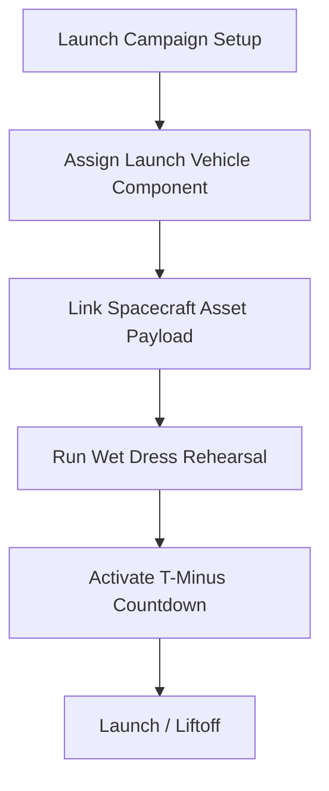
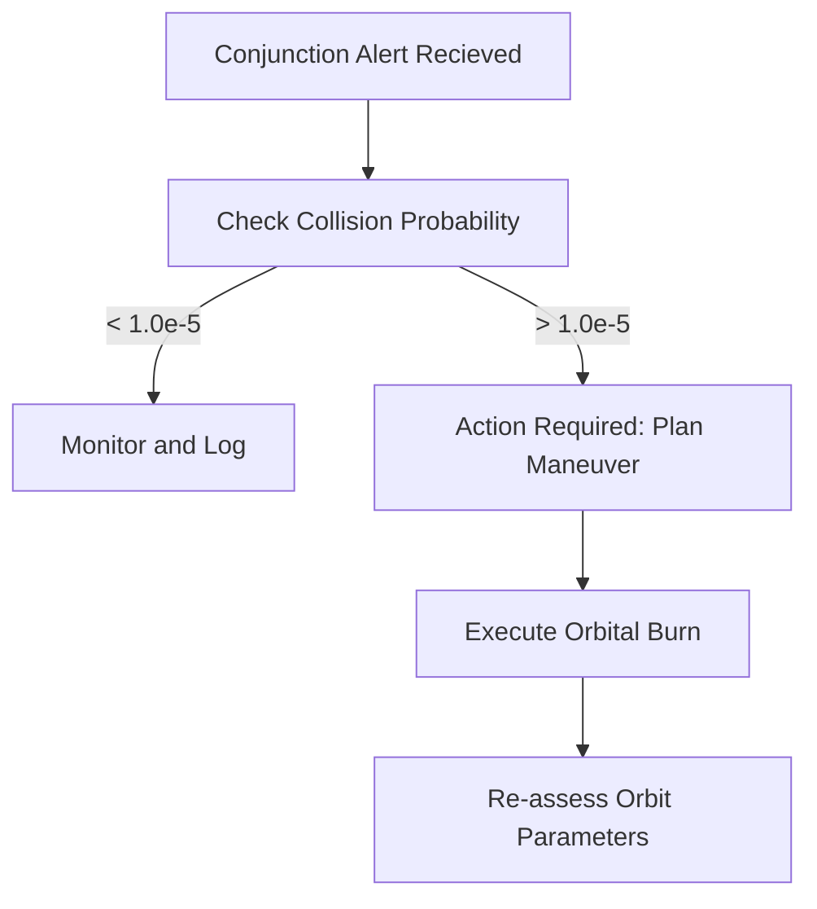

# 🚀 AeroSpaceOS — Standard Operating Procedure (SOP)
### Unified Functional Guide for Aviation & Spaceflight Operations

---

> **Document Version:** 2.0 (Unified Release)  
> **Application:** AeroSpaceOS ERPNext v15 (Aviation & Spaceflight Suite)  
> **Audience:** Airline Ops, Spaceflight Dispatchers, Mission Directors, Flight Crew & Astronauts, LAMEs, Pad Engineers, ITAR Control & Quality Managers  
> **Support:** ops-support@aerospace.bizaxl.org

---

## 📋 Table of Contents

1. [Getting Started & Administrative Setup](#1-getting-started--administrative-setup)
   - 1.1 [Access the Unified System](#11-access-the-unified-system)
   - 1.2 [Initial Setup (One-Time — Admin Only)](#12-initial-setup-one-time--admin-only)
   - 1.3 [ITAR/EAR Export Control Classification](#13-itarear-export-control-classification)
   - 1.4 [Assign Unified User Roles](#14-assign-unified-user-roles)
2. [Module 1 — Fleet & Asset Management (Aviation & Spacecraft)](#2-module-1--fleet--asset-management-aviation--spacecraft)
   - 2.1 [SOP — Adding a New Aircraft](#21-sop--adding-a-new-aircraft)
   - 2.2 [SOP — Tracking Aircraft Certificates](#22-sop--tracking-aircraft-certificates)
   - 2.3 [SOP — Registering a Spacecraft Asset](#23-sop--registering-a-spacecraft-asset)
   - 2.4 [SOP — Tracking Launch Vehicle Components](#24-sop--tracking-launch-vehicle-components)
3. [Module 2 — Flight & Space Mission Operations](#3-module-2--flight--space-mission-operations)
   - 3.1 [SOP — Creating a Flight Plan (Aviation)](#31-sop--creating-a-flight-plan-aviation)
   - 3.2 [SOP — Generating an Aircraft Load Sheet](#32-sop--generating-an-aircraft-load-sheet)
   - 3.3 [SOP — Post-Flight Record & Aircraft Utilization](#33-sop--post-flight-record--aircraft-utilization)
   - 3.4 [SOP — Creating a Launch Campaign & T-Minus Checklist](#34-sop--creating-a-launch-campaign--t-minus-checklist)
   - 3.5 [SOP — Managing Orbit & Trajectory States](#35-sop--managing-orbit--trajectory-states)
   - 3.6 [SOP — Scheduling Ground Station Passes](#36-sop--scheduling-ground-station-passes)
4. [Module 3 — Crew & Personnel Management (Aviation & Space)](#4-module-3--crew--personnel-management-aviation--space)
   - 4.1 [SOP — Managing Crew Licenses](#41-sop--managing-crew-licenses)
   - 4.2 [SOP — Logging Flight / Mission Duty Records](#42-sop--logging-flight--mission-duty-records)
   - 4.3 [SOP — Astronaut Biometrics & Radiation Monitoring](#43-sop--astronaut-biometrics--radiation-monitoring)
5. [Module 4 — Maintenance, Quality, & MRO (AS9100)](#5-module-4--maintenance-quality--mro-as9100)
   - 5.1 [SOP — Executing a Maintenance Work Order](#51-sop--executing-a-maintenance-work-order)
   - 5.2 [SOP — Airworthiness Directive (AD) Compliance Tracking](#52-sop--airworthiness-directive-ad-compliance-tracking)
   - 5.3 [SOP — Aerospace Quality Non-Conformance Reporting (NCR)](#53-sop--aerospace-quality-non-conformance-reporting-ncr)
6. [Module 5 — Logistics & Ground Operations](#6-module-5--logistics--ground-operations)
   - 6.1 [SOP — Ground Handling Orders (Aviation)](#61-sop--ground-handling-orders-aviation)
   - 6.2 [SOP — Launch Pad Cryogenic Propellant Load Logging](#62-sop--launch-pad-cryogenic-propellant-load-logging)
7. [Module 6 — Safety, SMS, & Environmental Risks](#7-module-6--safety-sms--environmental-risks)
   - 7.1 [SOP — Reporting a Safety Occurrence](#71-sop--reporting-a-safety-occurrence)
   - 7.2 [SOP — Managing the Unified Hazard Register](#72-sop--managing-the-unified-hazard-register)
   - 7.3 [SOP — Satellite Conjunction Assessment & Collision Avoidance](#73-sop--satellite-conjunction-assessment--collision-avoidance)
   - 7.4 [SOP — Space Weather Alert & Solar Storm Mitigation](#74-sop--space-weather-alert--solar-storm-mitigation)
8. [Module 7 — Unified Reports & Analytics](#8-module-7--unified-reports--analytics)
9. [Combined Operating Checklists (Daily, Weekly, Monthly)](#9-combined-operating-checklists-daily-weekly-monthly)
10. [User Roles & Permissions Matrix](#10-user-roles--permissions-matrix)
11. [Unified Frequently Asked Questions (FAQ)](#11-unified-frequently-asked-questions-faq)
12. [Support, IT, & Escalation Contact Details](#12-support-it--escalation-contact-details)

---

## 1. Getting Started & Administrative Setup

### 1.1 Access the Unified System

1. Open your browser and navigate to the AeroSpaceOS ERP URL:  
   `https://aerospace.bizaxl.org`
2. Login with your secure credentials provided by the IT department.
3. On the left sidebar, click on the **Aviation** or **AeroSpaceOS** workspace.
4. You will see the **AeroSpaceOS Dashboard** with quick-access cards and module links:
   - 🛫 Active Flights & Satellite Trackers
   - 🚀 Upcoming Launch Campaigns (T-Minus status)
   - 🔧 Open Work Orders & Aerospace Quality NCRs
   - ⚠️ Pending Safety Reports & Conjunction Alerts
   - 🛡️ ITAR/EAR Restrictive Indicators
   - 👤 Crew & Astronaut Duty Rosters

---

### 1.2 Initial Setup (One-Time — Admin Only)

> **Who does this:** System Administrator or Operations Head  
> **Purpose:** Seed the foundational structural objects to make the platform operational for both airline and rocket launch/satellite teams.

| Step | Action | Where |
|---|---|---|
| 1 | Configure Airports & Spaceports | Aviation → Ground Ops → Airport (e.g., KLAX, Cape Canaveral LC-39A) |
| 2 | Setup Aircraft & Spacecraft Types | Aviation → Fleet → Aircraft Type (e.g., B737-800, LEO-Satellite, Heavy-Lift Booster) |
| 3 | Initialize Airline / Operator Profile | Aviation → Fleet → Airline |
| 4 | Seed Unified Production/Demo Data | `bench --site aerospace.bizaxl.org execute aviation.aviation.setup.seed_data.execute` |

---

### 1.3 ITAR/EAR Export Control Classification

> [!IMPORTANT]
> Because aerospace technology (satellites, spacecraft, and boosters) is subject to strict national security regulations, access to technical files must be configured inside the ITAR/EAR access control registry before uploading blueprints or MRO work logs.

**Who:** Export Control / ITAR Officer  
**When:** Immediately after system setup and before any technical data entry  

1. Navigate to **Compliance → ITAR EAR Access Control**.
2. Click **+ New**.
3. Select the **Ref Doctype** (e.g., `Aircraft`, `Spacecraft Asset`, `Maintenance Work Order`, or `Attachment`).
4. Enter the specific **Ref Docname** (e.g., a technical manual or rocket engine design sheet).
5. Select the **Jurisdiction** (`ITAR`, `EAR`, or `Non-Controlled`).
6. Input the **USML Category** or **ECCN Number** (e.g., XV(a) for spacecraft systems).
7. In the **Authorized Nationalities** child table, add countries whose citizens are legally allowed access.
8. Tick **Export License Required** if an active State Department or Commerce license is needed, and link the **Export License ID**.
9. Click **Save** and **Submit**.

---

### 1.4 Assign Unified User Roles

> **Who does this:** Administrator or HR Manager

Go to **ERPNext → Users**, select the employee, and assign the appropriate roles in the permissions panel:

| Role | Aviation Operations | Spaceflight / Satellite Operations |
|---|---|---|
| **AeroSpace Manager** | Oversees high-level airline operations, P&L, fleet schedules. | Approves launch campaigns, reviews high-level space weather hazards. |
| **Mission Director** | N/A | Full operational control of Launch Campaigns, T-minus sequences, orbital maneuvers. |
| **Flight Operations Officer** | Flight planning, load sheets, fuel uplifts, and airline dispatch. | N/A |
| **Maintenance Engineer** | Executes aircraft work orders, signs off Release to Service, registers SB/AD. | Performs booster inspections, signs off pad assembly work orders. |
| **Quality Manager** | Verifies aviation compliance, manages certificates and AD logs. | Oversees AS9100 quality, initiates Non-Conformance Reports (NCR) and CAPAs. |
| **Crew Scheduler** | FDP limits, pilot rosters, medical certificate checks. | Rosters astronaut training, manages simulator schedules, biometric reviews. |
| **Safety Officer** | SMS occurrence reports, bird strike analysis, hazard logs. | Manages satellite conjunction logs, space debris tracking, radiation alarms. |
| **ITAR Control Officer** | N/A | Monitors citizenship restrictions, approves foreign-national access to parts. |

---

## 2. Module 1 — Fleet & Asset Management (Aviation & Spacecraft)

> **Purpose:** Track the lifecycle, configuration, and utilization of both atmospheric (aircraft) and orbital (satellites, boosters, stages) hardware assets.

---

### 2.1 SOP — Adding a New Aircraft

**Who:** Fleet Manager / Engineering Admin  
**When:** When a new aircraft enters the fleet  

1. Navigate to **Fleet Management → Aircraft**.
2. Click **+ New**.
3. Enter the **Registration** (e.g., `VT-ABX`).
4. Select the correct **Aircraft Type** and **Airline**.
5. Input the **Manufacture Date** and **MSN** (Manufacturer Serial Number).
6. Input initial **Total Airframe Hours** and **Cycles**.
7. Attach the **Certificate of Registration** in the sidebar.
8. Click **Save** and **Submit**.

✅ **Expected Result:** Aircraft record is created. Utilization tracking begins from the entered hours/cycles.

---

### 2.2 SOP — Tracking Aircraft Certificates

**Who:** Quality & Compliance Officer  
**When:** Upon issuance or renewal of any certificate  

1. Go to **Fleet Management → Aircraft Certificate**.
2. Click **+ New**.
3. Select the target **Aircraft**.
4. Select the **Certificate Type** (e.g., `Certificate of Airworthiness`, `Certificate of Registration`, `Radio License`).
5. Enter **Certificate Number** and **Issuing Authority** (e.g., FAA, EASA, DGCA).
6. Set **Issue Date** and **Expiry Date**.
7. Click **Save**.

> [!TIP]
> The system auto-calculates "Days to Expiry". Expiring certificates will appear highlighted in red on the **Compliance Dashboard**.

---

### 2.3 SOP — Registering a Spacecraft Asset

**Who:** Space Fleet Planner / Satellite Operations Lead  
**When:** When a new satellite, orbital capsule, or rocket stage is launched/acquired  

1. Navigate to **Fleet Management → Spacecraft Asset**.
2. Click **+ New**.
3. Enter **Spacecraft ID** (e.g., `SAT-LEO-109`) and **Spacecraft Name** (e.g., `Seria-Sat 1`).
4. Select **Owner Airline** (which maps to the operating aerospace company profile).
5. Choose the **Spacecraft Type** (`Satellite`, `Launch Vehicle Booster`, `Upper Stage`, or `Crew Capsule`).
6. Select the target **Orbit Type** (`LEO`, `MEO`, `GEO`, `Sun-Synchronous`, `Lunar`, or `Interplanetary`).
7. Enter the **Estimated Lifetime (Years)** (e.g., `7.5`).
8. Select the **Propellant Type** (`Hydrazine`, `Xenon`, `Cold Gas`, or `Bipropellant`).
9. Enter the **Propellant Capacity (kg)** (e.g., `150.00`) and the initial **Current Propellant Level (kg)**.
10. Input the **Delta-V Budget (m/s)** (e.g., `240.00`).
11. Set the initial **Status** (`Integration`, `Pre-Launch`, or `Active`).
12. Click **Save** and **Submit**.

✅ **Expected Result:** Spacecraft Asset is registered. The Mission Elapsed Time (MET) clock begins tracking from launch date.

---

### 2.4 SOP — Tracking Launch Vehicle Components

**Who:** Pad & Integration Engineer  
**When:** When a reusable first-stage booster or fairing is received from manufacturing or recovered from sea  

1. Go to **Fleet Management → Launch Vehicle Component**.
2. Click **+ New**.
3. Enter the **Component ID** (e.g., `B1058`).
4. Select the **Component Type** (`First Stage Booster`, `Second Stage`, `Payload Fairing Half`, or `Launch Abort System`).
5. Input the **Manufacturer** (e.g., `Seria Space Tech`).
6. Set the **Number of Launches** (e.g., `14` if recovered, or `0` for new) and **Refurbishment Cycles** completed.
7. Set the **Status** (`In Manufacturing`, `Refurbishing`, `Ready for Flight`, `Expended`, or `Destroyed`).
8. Click **Save**.

---

## 3. Module 2 — Flight & Space Mission Operations

> **Purpose:** Plan and execute journeys, whether atmospheric routes between commercial airports or orbital deployment missions into specific Keplerian orbits.

---

### 3.1 SOP — Creating a Flight Plan (Aviation)

**Who:** Flight Dispatcher / Pilot  
**When:** Prior to flight departure  

1. Go to **Flight Operations → Flight Plan**.
2. Click **+ New**.
3. Enter **Flight Number** (e.g., `SV102`) and **Flight Date**.
4. Select the assigned **Aircraft** (e.g., `VT-ABX`) and atmospheric **Route**.
5. Set the estimated times: **ETD** and **ETA** (must be recorded in UTC).
6. Enter the **Trip Fuel** and **Block Fuel** estimates (in kg or lbs).
7. Assign the **Crew Members** (Captain, FO, Cabin Crew) in the assignments child table.
8. Set the status to **Filed** and click **Submit**.

---

### 3.2 SOP — Generating an Aircraft Load Sheet

**Who:** Load Controller / Captain  
**When:** After passenger boarding and cargo loading are complete, before engine start  

1. Navigate to **Flight Operations → Load Sheet**.
2. Click **+ New**.
3. Link to the active **Flight Operation** record.
4. Enter the **Dry Operating Weight (DOW)** of the aircraft.
5. Input the actual **Passenger Count** and **Cargo/Baggage Weights** per zone.
6. Verify that **Zero Fuel Weight (ZFW)** and **Take-off Fuel** reconcile correctly.
7. Ensure that the calculated **Take-off Weight** is within the structural limits of the aircraft.
8. Click **Save** and print a hardcopy/digital copy for the Captain's signature.

---

### 3.3 SOP — Post-Flight Record & Aircraft Utilization

**Who:** Captain / Flight Operations Officer  
**When:** Within 30 minutes of engine shutdown ("On-Blocks")  

1. Open the active **Flight Operation** record.
2. Enter the actual times: **Off-Block**, **Takeoff**, **Landing**, and **On-Block**.
3. Input the **Fuel on Arrival** (the system will calculate actual fuel consumption).
4. Record any flight delay durations along with the corresponding **IATA Delay Codes**.
5. Enter the **Tech Log** entry number if any maintenance defects occurred.
6. Set the status to **Completed** and click **Submit**.

✅ **Expected Result:** The system automatically adds the flight block hours to the **Aircraft** record and increments the airframe **Cycles** by 1.

---

### 3.4 SOP — Creating a Launch Campaign & T-Minus Checklist

**Who:** Mission Director / Launch Operations Lead  
**When:** Upon initiation of rocket assembly and integration for a planned orbital mission  

1. Navigate to **Mission Operations → Launch Campaign**.
2. Click **+ New**.
3. Enter a unique **Campaign ID** (e.g., `L-109`).
4. Link the **Launch Vehicle Booster** (e.g., `B1058`) and select the **Launch Site** / Pad (e.g., `Cape Canaveral LC-39A` from the Airport doctype).
5. Specify the **Launch Window Start UTC** and **Launch Window End UTC**.
6. Link the **Primary Payload** to a registered `Spacecraft Asset` (e.g., `SAT-LEO-109`).
7. In the **Launch Countdown Checklist** child table, click **Add Row** to input the crucial T-minus sequence:
   * **T-Minus Time:** e.g., `T-02:00:00`
   * **System:** Select `Propellant`, `Guidance`, `Range`, `Telemetry`, or `Avionics`.
   * **Action:** e.g., `Initiate Liquid Oxygen loading protocols`.
   * **Status:** Set to `Pending`.
8. Click **Save**.
9. **Executing the Countdown:** As steps are completed, the respective subsystem controller changes the status to **Complete**. If a system reports an anomaly, set to **Hold**, which automatically triggers a global countdown pause in Mission Control.
10. Once launched successfully, change the main status to **Launched** and click **Submit**.

---

### 3.5 SOP — Managing Orbit & Trajectory States

**Who:** Trajectory & Navigation Engineer  
**When:** After spacecraft orbit injection, and weekly during orbital maintenance  

1. Go to **Mission Operations → Orbit Parameter**.
2. Click **+ New**.
3. Select the target **Spacecraft** (e.g., `SAT-LEO-109`).
4. Set the **Epoch UTC** (exact timestamp of the Keplerian vector reading).
5. Input the classical orbital elements:
   * **Semi-Major Axis (km):** (e.g., `6878.14`)
   * **Eccentricity:** (e.g., `0.00012` for near-circular)
   * **Inclination (deg):** (e.g., `97.4` for sun-synchronous)
   * **Apogee (km)** & **Perigee (km)** (e.g., `510` and `498`)
   * **Orbital Period (minutes):** (e.g., `94.6`)
   * **RAAN (deg)** & **Argument of Perigee (deg)**
6. Click **Save**.

---

### 3.6 SOP — Scheduling Ground Station Passes

**Who:** Ground Network Scheduler / Telemetry Engineer  
**When:** Daily, to plan antenna downlink windows  

1. Navigate to **Mission Operations → Ground Station Pass**.
2. Click **+ New**.
3. Select the **Spacecraft** to communicate with.
4. Enter the **Ground Station Name** (e.g., `Svalbard Ground Station`, `Hartebeesthoek`).
5. Set the **Pass Start UTC** and **Pass End UTC** (the time window when the spacecraft is above the local horizon).
6. Input the **Max Elevation (deg)** (elevations below 10° may suffer atmospheric degradation).
7. Enter the **Downlink Frequency (MHz)**.
8. **Post-Pass Update:** Once the pass is complete, update the **Telemetry Status** (`Good`, `Degraded`, or `No Signal`) to flag communication performance. Click **Save**.

---

## 4. Module 3 — Crew & Personnel Management (Aviation & Space)

> **Purpose:** Track training, licensing, duty hours, rest limits, and physical health indexes of both flight deck pilots and spaceflight astronauts.

---

### 4.1 SOP — Managing Crew Licenses

**Who:** Training Administrator / Flight Surgeon  
**When:** Upon issuance, renewal, or completion of a new qualification class  

1. Go to **Crew Management → Crew Licence**.
2. Select the **Crew Member** (e.g., Captain John Doe or Astronaut Sarah Connor).
3. Select the **Licence Type** (`Airline Transport Pilot Licence (ATPL)`, `Commercial Pilot Licence (CPL)`, or `Astronaut Commander Rating`).
4. Enter the **Licence Number** and **Issuing Authority**.
5. Input **Medical Class** (e.g., `Class 1` for pilots, `Class 1 - Spaceflight Qualified` for astronauts) and the **Medical Expiry Date**.
6. Set the status to **Active** and upload a digital PDF copy of the certification. Click **Save**.

---

### 4.2 SOP — Logging Flight / Mission Duty Records

**Who:** Crew Member / Mission Controller  
**When:** Immediately after completing any flight block, space station shift, or simulator training  

1. Go to **Crew Management → Crew Duty Record**.
2. Select the **Crew Member**.
3. Link the corresponding **Flight Operation** (leave blank for simulator, training, launch standby, or mission control console duty).
4. Select the **Role on Flight** (e.g., `Captain`, `First Officer`, `Commander`, `Mission Specialist`).
5. Set the **Duty Start (UTC)** and **Duty End (UTC)**.
6. Click **Submit**.

> [!WARNING]
> The system auto-calculates the Flight Duty Period (FDP) and consecutive duty days. If the duty hours violate local civil aviation rules (e.g., FAA Part 121) or NASA astronaut sleep/rest requirements, a **Safety Violation Notification** is automatically dispatched to the Safety Officer.

---

### 4.3 SOP — Astronaut Biometrics & Radiation Monitoring

**Who:** Aerospace Flight Surgeon  
**When:** Weekly during orbital operations or after solar weather anomalies  

1. Navigate to **Crew Management → Astronaut Biometrics**.
2. Select the **Astronaut** (must have an active `Spaceflight Qualified` license).
3. Input the **Heart Rate (avg)**, **Blood Pressure**, and **Oxygen Saturation** statistics.
4. Input the **Cumulative Radiation Dose (mSv)** (this is crucial for LEO/MEO missions to ensure lifetime career exposure thresholds are not breached).
5. Attach the medical report files.
6. Click **Save**.

---

## 5. Module 4 — Maintenance, Quality, & MRO (AS9100)

> **Purpose:** Execute scheduled inspection checks and manage unexpected parts failures. All MRO activities are monitored for strict AS9100 aerospace quality compliance.

---

### 5.1 SOP — Executing a Maintenance Work Order

**Who:** Maintenance Planner / Certified Engineer (LAME)  
**When:** When an aircraft or booster component is checked in for inspection, repair, or overhaul  

1. Go to **Maintenance → Maintenance Work Order**.
2. Click **+ New**.
3. Select the **Aircraft** (e.g., `VT-ABX`) or the **Launch Vehicle Component** (e.g., `B1058`).
4. Choose the **Maintenance Type** (`A-Check`, `C-Check`, `Line Maintenance`, `Booster Refurbishment`, or `Engine Overhaul`).
5. In the tasks table, append the **Maintenance Task Cards** (e.g., Turbine Blade Inspection, Sensor Calibration, LOX Valve Flush).
6. Set the status to **In Progress** when mechanics begin work.
7. **Issuing Release to Service:** Once all tasks are completed, the certified engineer (LAME) enters their **Licence Number** and signs off the **Release to Service** section.
8. Click **Submit**.

---

### 5.2 SOP — Airworthiness Directive (AD) Compliance Tracking

**Who:** Quality & Airworthiness Engineer  
**When:** Upon release of a new mandatory AD by the FAA, EASA, or local civil aviation authorities  

1. Go to **Maintenance → Airworthiness Directive** and create the base AD record (detailing thresholds, e.g., inspect within 50 flight cycles).
2. Navigate to **Maintenance → AD Compliance Record**.
3. Click **+ New**.
4. Select the **AD** and link the specific **Aircraft** or aircraft engine being certified.
5. Set the **Compliance Status** (`Complied - Terminating`, `Complied - Repetitive`, or `Pending`).
6. Enter the exact **Compliance Date**, and the current **Airframe Hours/Cycles** at which the inspection was executed.
7. Click **Save** and **Submit**.

---

### 5.3 SOP — Aerospace Quality Non-Conformance Reporting (NCR)

> [!CAUTION]
> In accordance with AS9100 aerospace quality standards, any structural defect, unauthorized parts substitution, or out-of-tolerance measurement found during maintenance or pad integration must be logged as a Non-Conformance Report (NCR) to prevent mission failure.

**Who:** AS9100 Quality Auditor / Lead Engineer  
**When:** Immediately when a part or process does not conform to technical requirements  

1. Navigate to **Maintenance → Aerospace Quality NCR**.
2. Click **+ New**.
3. Link the originating **Maintenance Work Order** where the non-conformance was observed.
4. Select the affected **Part Number** (e.g., `VALVE-LOX-01`) and enter the **Serial Number** of the specific unit.
5. Set the **Severity** of the deviation (`Minor`, `Major`, or `Critical`).
6. Provide a meticulous description in the **Non-Conformance Description** field.
7. Select the proposed **Disposition** action:
   * `Scrap`: The part is destroyed to prevent accidental usage.
   * `Rework`: The part is returned to production to be brought back into drawing spec.
   * `Use-As-Is`: Engineering certifies the defect is structurally inconsequential.
   * `Repair`: Special technical repairs are applied to make the part functional.
8. Tick **Corrective and Preventive Action Required (CAPA)** if a root-cause analysis is needed to prevent recurrence.
9. Link the **Quality Manager Signature** (Frappe User verification).
10. Click **Save** and **Submit**.

---

## 6. Module 5 — Logistics & Ground Operations

> **Purpose:** Supply chain support and launchpad fueling. Replaces simple airport ground handling with cryogenic fluid logistics.

---

### 6.1 SOP — Ground Handling Orders (Aviation)

**Who:** Ground Ops Coordinator  
**When:** 24 hours prior to commercial flight arrival  

1. Go to **Ground Operations → Ground Handling Order**.
2. Select the local **Handling Company** and target **Airport**.
3. Input the **Flight Number** and the expected **Service Date**.
4. Check the box for each required ground service: Catering, Pushback, Lavatory Servicing, Cabin Cleaning, Baggage Handling, or Jet A-1 Fuel Uplift.
5. Click **Save**.

---

### 6.2 SOP — Launch Pad Cryogenic Propellant Load Logging

> [!WARNING]
> Cryogenic rocket propellants (LOX, LH2, Liquid Methane) undergo severe boil-off (vaporization) under atmospheric temperatures. Pad engineers must track precise loading masses, tank pressures, and boil-off rates to ensure the rocket launches with a full propellant stack.

**Who:** Launch Pad Fueling Engineer  
**When:** During the T-minus fueling window (generally T-4 hours to T-15 minutes)  

1. Navigate to **Pad Logistics → Propellant Load Log**.
2. Click **+ New**.
3. Select the active **Launch Campaign** (e.g., `L-109`).
4. Select the **Propellant Type** (`Liquid Oxygen (LOX)`, `Liquid Hydrogen (LH2)`, `RP-1 Rocket Kerosene`, `Liquid Methane (LCH4)`, `Hydrazine`, or `Xenon Gas`).
5. Enter the **Target Loading Mass (kg)** (e.g., `250000.00`).
6. Input the **Actual Loaded Mass (kg)** as measured by the pad flow meters.
7. Enter the current **Cryo Temperature (Kelvin)** (e.g., `90` Kelvin for LOX) and the **Tank Pressure (PSI)**.
8. Record the calculated **Boil-Off Rate (kg/min)** (this enables the system to calculate the countdown hold timeout limits).
9. Input the **Loading Start UTC** and **Loading End UTC**.
10. Click **Save** and **Submit**.

---

## 7. Module 6 — Safety, SMS, & Environmental Risks

> **Purpose:** Protect personnel, equipment, and flight crew from injury or accident. Expands standard SMS into orbital space hazard management.

---

### 7.1 SOP — Reporting a Safety Occurrence

**Who:** Any System User (Pilot, Mechanic, Astronaut, Pad Operator)  
**When:** Immediately after any incident, near-miss, laser strike, or procedure deviation  

1. Navigate to **Safety & SMS → Safety Occurrence Report**.
2. Click **+ New**.
3. Choose the **Occurrence Type** (`Hazard`, `Incident`, `Accident`, `Near-Miss`, `Bird Strike`, `Laser Strike`, or `Space Debris Conjunction`).
4. Set the **Severity** level (`Minor`, `Moderate`, `Major`, or `Critical`).
5. Provide a highly descriptive **Narrative** detailing the event.
6. Tick **is_anonymous** if you wish to hide the reporter's name for confidentiality (enforces a "Just Culture").
7. Click **Submit**.

✅ **Expected Result:** The Safety Officer is alerted. The system creates a linked **Safety Investigation** record automatically.

---

### 7.2 SOP — Managing the Unified Hazard Register

**Who:** Safety Director / Mission Safety Lead  
**When:** Weekly safety board meetings  

1. Go to **Safety & SMS → Hazard Register**.
2. Click **+ New** to register a systemic operational risk (e.g., Microgravity bone density loss, pad lightning strikes, fatigue on night dispatch).
3. Assign the **Risk Assessment** matrix values (Likelihood vs Severity) to get the overall risk rating (`High`, `Medium`, or `Low`).
4. Detail the explicit **Mitigation Plan** (e.g., Mandatory physical training, high-speed grounding clamps).
5. Set the status to **Open** until the mitigation is validated in the field.

---

### 7.3 SOP — Satellite Conjunction Assessment & Collision Avoidance

> [!CAUTION]
> Space debris poses an existential risk to active satellites. Collision probability must be actively monitored. If the probability exceeds 1.0e-4, an avoidance maneuver must be executed.

**Who:** Space Safety Officer / Orbital Mechanics Lead  
**When:** Upon receipt of a conjunction alert from CSpOC / Space-Track  

1. Navigate to **Safety & SMS → Conjunction Assessment**.
2. Click **+ New**.
3. Select the affected **Spacecraft Asset** (e.g., `SAT-LEO-109`).
4. Enter the **Debris Catalog ID** (e.g., NORAD ID `43210` representing an expended rocket stage).
5. Set the **Closest Approach UTC** and the **Miss Distance (meters)** (e.g., `120.0` meters).
6. Enter the **Collision Probability** (e.g., `0.00014` or `1.4e-4`).
7. If the probability is higher than `1.0e-5`, tick **Action Required**.
8. Outline the **Mitigation Maneuver Plan** (e.g., "Fire thrusters for a 3-second retrograde burn at Epoch - 4 hours to raise perigee by 200m").
9. Set the status to **Maneuver Planned**. Once the spacecraft telemetry confirms burn completion, set status to **Closed** and click **Submit**.

---

### 7.4 SOP — Space Weather Alert & Solar Storm Mitigation

**Who:** Mission Safety Lead / Space Weather Officer  
**When:** Upon receipt of NOAA/SWPC Solar Radiation alerts  

1. Go to **Safety & SMS → Space Weather Alert**.
2. Click **+ New**.
3. Set the **Alert UTC** and choose the **Solar Flare Class** (`C-Class`, `M-Class`, or `X-Class`).
4. Input the **Geomagnetic Storm Kp Index** (scale of 0-9, with Kp >= 5 representing a storm).
5. Input the measured **Solar Radiation Level**.
6. In the **Affected Satellites** table, pull in the registered LEO/MEO `Spacecraft Assets` that are in the path of radiation.
7. Select the **Action Taken** to protect the electronics:
   * `Safe Mode Triggered`: Spacecraft enters a low-power, non-operational state.
   * `Battery Charging Optimized`: Limits battery thermals during high-charge events.
   * `Crew Shielding Protocol`: Flight crew/astronauts are instructed to enter the most shielded module.
8. Click **Save** and **Submit**.

---

## 8. Module 7 — Unified Reports & Analytics

AeroSpaceOS provides high-fidelity, unified reports for airline heads, launch logistics managers, and aerospace regulatory bodies:

| Report Name | Module | Focus Metrics | Primary Filters |
|---|---|---|---|
| **Aircraft Utilization** | Fleet Management | Block Hours, Airframe Cycles, Flight Delays | Aircraft ID, Date Range |
| **Spacecraft Propellant Audit** | Spacecraft Fleet | Remaining Propellant (kg), Delta-V Budget | Spacecraft ID, Orbit Type |
| **Crew Duty & FDP Report** | Crew Management | Active Duty Hours, Sleep Records, Violations | Crew Member, Month |
| **Maintenance Forecasting** | Maintenance (MRO) | Remaining Time to Check (Hours/Cycles) | Aircraft, Component ID |
| **Aerospace Quality NCR Analysis** | Quality (AS9100) | Disposition breakdown (Scrap vs Rework) | Part Number, Severity |
| **ITAR/EAR Access Log** | Export Compliance | Citizenship checks, authorization logs | User, Ref Doctype |
| **Conjunction Assessment Trend** | Space Safety | Closest approach clusters, miss distances | Spacecraft, Miss Distance |

---

## 9. Combined Operating Checklists (Daily, Weekly, Monthly)

### 9.1 Daily Checklist (Morning Dispatch & Pre-Launch Operations)

| Task | Category | Responsible |
|---|---|---|
| ☐ Verify all active Aircraft Certificates are valid | Aviation Ops | Compliance Officer |
| ☐ Review NOAA Space Weather forecast for solar anomalies | Space Ops | Space Weather Officer |
| ☐ Reconcile FDP duty limits for flight crews on today's roster | Crewing | Crew Scheduler |
| ☐ Execute T-minus checklist step verification for active campaigns | Launch Ops | Mission Director |
| ☐ Run orbital collision proximity checks against NORAD catalog | Space Safety | Safety Officer |
| ☐ Check and log daily airport and spaceport weather reports | Ground Ops | Dispatcher |

---

### 9.2 Weekly Operational Review

| Task | Category | Responsible |
|---|---|---|
| ☐ Reconcile fuel uplifts vs airline flight logs | Ground Ops | Aviation Manager |
| ☐ Log propellant boil-off volumes and pad pressure logs | Pad Logistics | Pad Lead |
| ☐ Conduct AS9100 Quality audit on open Non-Conformance Reports | Quality | Quality Manager |
| ☐ Check cumulative radiation dose logs for orbital crew | Space Medicine | Flight Surgeon |
| ☐ Perform repetitive Airworthiness Directive (AD) compliance audits | Engineering | Maintenance Planner |

---

### 9.3 Monthly Regulatory & Compliance Audit

| Task | Category | Responsible |
|---|---|---|
| ☐ Audit all document downloads against ITAR/EAR access records | Security | ITAR Officer |
| ☐ Review aircraft certificate expiries (30/60/90 days forecast) | Compliance | Quality Manager |
| ☐ Generate fleet utilization reports (Block hours & satellite MET) | Fleet Mgmt | Fleet Planner |
| ☐ Review open safety incident investigations and hazard mitigations | SMS | Safety Director |

---

## 10. User Roles & Permissions Matrix

| Feature / DocType | AeroSpace Manager | Mission Director | Flight Ops Officer | Maintenance Engineer | ITAR Control Officer | Safety Officer | Quality Manager |
|---|---|---|---|---|---|---|---|
| **Aircraft Asset** | ✅ | 👁 | 👁 | 👁 | ❌ | 👁 | 👁 |
| **Spacecraft Asset** | ✅ | ✅ | ❌ | 👁 | 👁 | 👁 | 👁 |
| **Flight Plan** | 👁 | ❌ | ✅ | ❌ | ❌ | 👁 | ❌ |
| **Launch Campaign** | 👁 | ✅ | ❌ | 👁 | 👁 | 👁 | 👁 |
| **Maintenance Work Order**| 👁 | 👁 | ❌ | ✅ | ❌ | 👁 | ✅ |
| **Aerospace Quality NCR**| 👁 | 👁 | ❌ | 👁 | ❌ | 👁 | ✅ |
| **Conjunction Assessment**| 👁 | ✅ | ❌ | ❌ | ❌ | ✅ | ❌ |
| **ITAR EAR Access** | 👁 | 👁 | ❌ | ❌ | ✅ | ❌ | 👁 |

*Legend: ✅ Full Write/Submit | 👁 Read-Only | ❌ No Access*

---

## 11. Unified Frequently Asked Questions (FAQ)

#### Q1: How does the system prevent non-compliant crews from flying?
**A:** When submitting a **Flight Plan** or **Launch Campaign**, the system's underlying script runs a check against the linked crew's **Crew Licence** (for valid medical dates and active ratings) and **Crew Duty Record** (to check FDP limits). If any discrepancies are found, the submission fails with a validation error.

#### Q2: Why is the spacecraft "Current Propellant Level" not updating?
**A:** Propellant levels only update once a **Propellant Load Log** or telemetry data is submitted. If you are integrated with Mission Control, ensure that the telemetry ingestion API (`aviation.aviation.api.spaceflight_api.ingest_telemetry`) is actively posting.

#### Q3: What is the process for scrap disposition of an aerospace component?
**A:** Create an **Aerospace Quality NCR**, select `Scrap` as the disposition, outline the non-conformance description, and submit. The physical part must be tagged with a red label, mutilated to prevent reuse, and recorded as scrapped in the inventory ledgers.

#### Q4: How is ITAR/EAR access enforced on files?
**A:** When a user attempts to view a `Spacecraft Asset`, `Maintenance Work Order`, or attachment, the system queries the **ITAR EAR Access Control** records. If the asset is classified under ITAR/EAR, the system matches the user's recorded citizenship against the **Authorized Nationalities** list. Access is blocked if the user is a non-authorized foreign national.

#### Q5: When should an orbital collision maneuver be logged?
**A:** When the **Conjunction Assessment** indicates a probability of collision greater than `1.0e-5` (or a miss distance under 150m), immediately log the assessment, tick **Action Required**, type in the mitigation plan, and coordinate with the Flight Dynamics team to schedule the retrograde/prograde burn.

---

## 12. Support, IT, & Escalation Contact Details

For technical issues, login resets, ITAR authorization requests, or system bugs:

📧 **Operations Email:** support@aerospace.bizaxl.org  
📞 **24/7 Operations Hot-line:** +91-XXX-XXX-XXXX  
💬 **Slack Workspace:** `#aerospace-ops-erp`  
🌐 **Documentation Portal:** `https://docs.aerospace.bizaxl.org`  

---
*End of AeroSpaceOS Standard Operating Procedure (SOP)*
